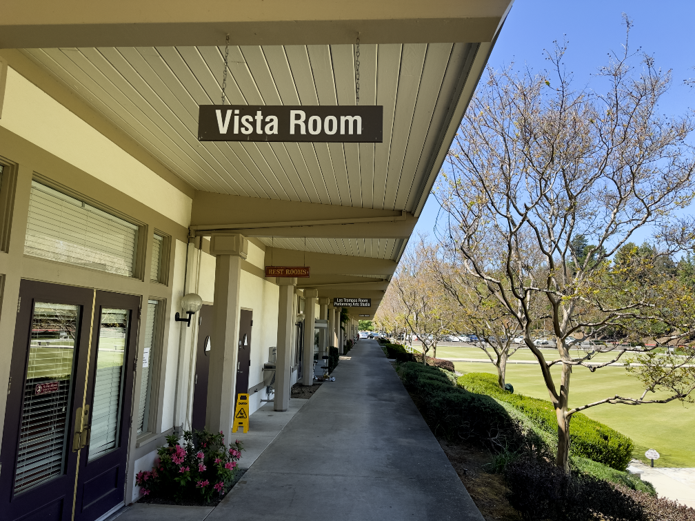

<section>
    

        

            

                
                
Our group meets in the Vista Room of the Hillside complex, located at 3400 Golden Rain Road in Rossmoor.

            

            

                <h2>About Rossmoor Unitarian Universalists</h2>
                
We are a vibrant and inclusive community of individuals from Rossmoor and surrounding areas, united by our values of justice, compassion, and respect. Our group is committed to providing a welcoming space for all who seek to explore their spirituality, make meaningful connections, and cultivate personal growth.

                <h2>Meetings</h2>
                
Our monthly gatherings take place on the second Friday of each month in the Vista Room of the Hillside complex at 11:30 am. Each meeting features a brown bag lunch program, where we come together to share food, conversation, and ideas. We invite all Rossmoor residents and their guests to join us for these informal and engaging events.

                <h2>Getting Involved</h2>
                
If you're interested in learning more about our community or would like to get involved, please contact us. We look forward to welcoming you to our table!

                
                <h3>Interested in helping with the website?</h3>
                
If you are interested in helping with the Rossmoor UU website, please 
                <a href="mailto:steve@rossmooruu.org?subject=Website Volunteer">contact Steve Ogden</a>. No experience necessary.

            

        

    

</section>
